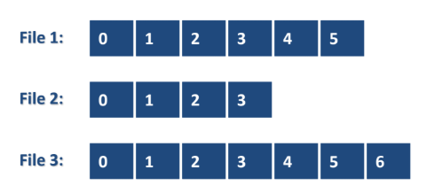
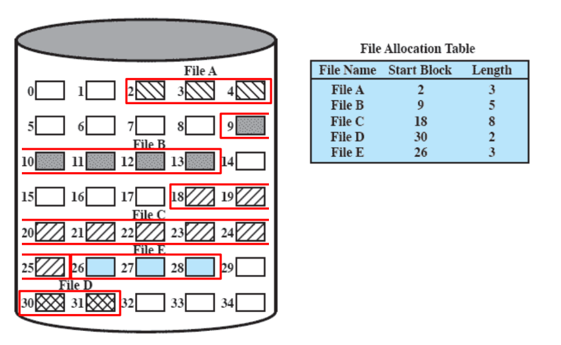
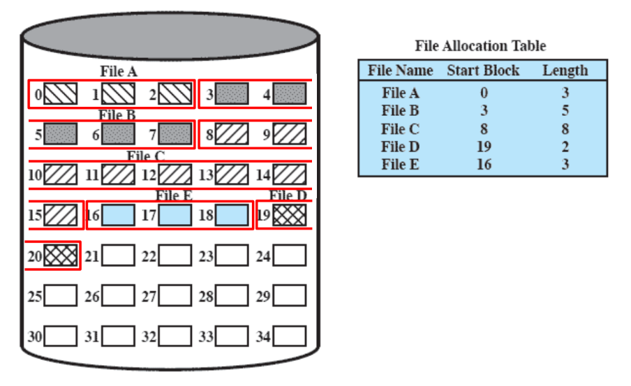
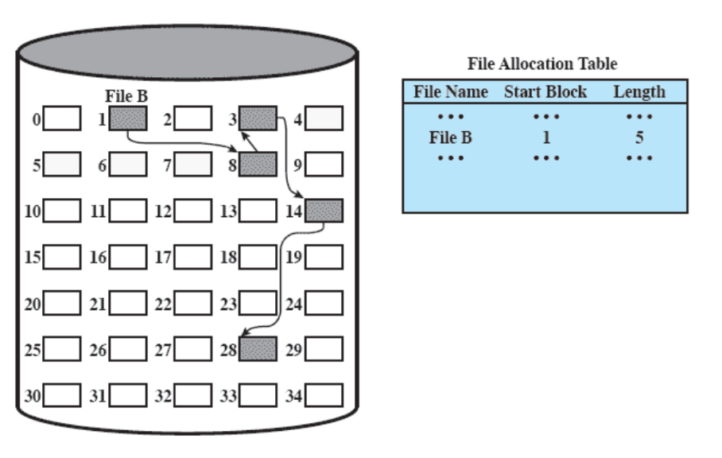
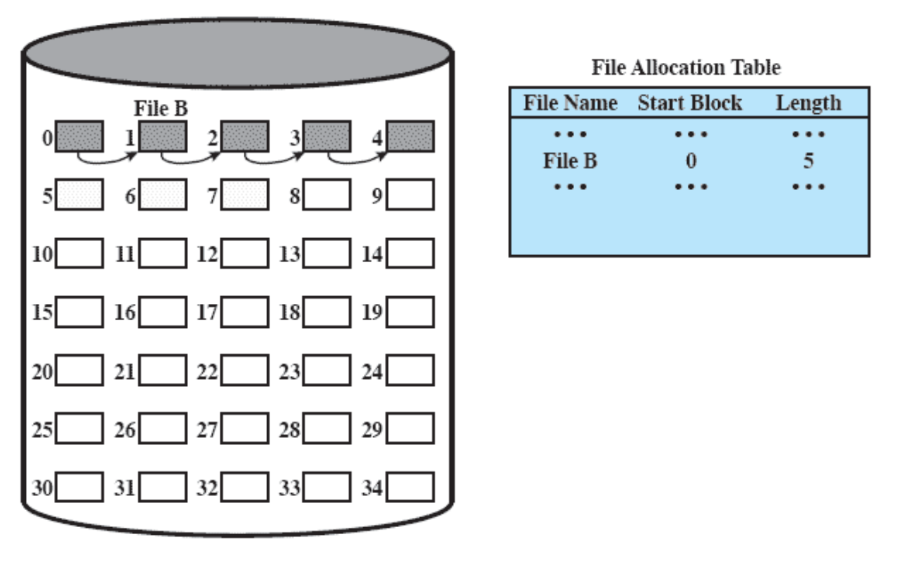
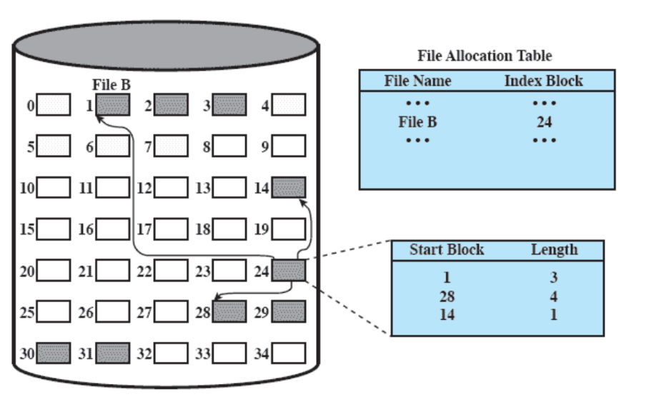
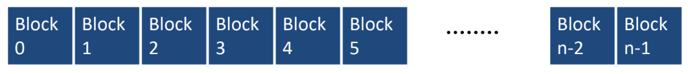

# Dateisystem- und Speicherverwaltung

!!! Definition
    Ein **Sekundärspeicher** ist ein nichtflüchtiger Datenspeicher, der Daten dauerhaft speichert, auch wenn der Strom abgeschaltet ist.
    
    Im Gegensatz ist der flüchtigen **Primärspeicher** (RAM), bei dem Daten verloren gehen, wenn das Gerät ausgeschaltet wird.

## Aufgaben der Sekundärspeicherverwaltung
- Dateien = Sequenzen von Blöcken, die relativ zum Beginn nummeriert sind.
- Aufgaben:
    1. Zuweisung von Blöcken zu Dateien  
    2. Verwaltung freier Blöcke  
    3. Verwaltung defekter Blöcke  

---

## Dateizuordnungsverfahren

Wie teilt man Dateien auf eine Festplatte auf?

Wir betrachten drei Arten theoretische Arten der Zuordnung:

* Contiguos Allocation
* Chained Allocation
* Indexed Allocation

Chained und Indexed Allocation sind sogenannte distributed Allocations.

### Contiguous Allocation
- Dateien liegen in **zusammenhängenden Blöcken**.  
- Verwaltungseintrag: Startblock + Länge.  
- **Vorteile:** schnelle sequentielle und wahlfreie Zugriffe, einfaches Management.  
- **Nachteile:** externe Fragmentierung, teures Vergrößern, Kompaktierung nötig.  

  

Nach der Kompaktierung:

---

### Distributed Allocation
- Nur interne Fragmentierung.  
- Dynamische Größenänderungen leicht möglich.  
- **Nachteile:** kein einheitlicher Zugriff, komplexeres Management.  
- Varianten:
     - **Chained Allocation:** Jeder Block enthält Zeiger auf den nächsten. Gut für sequentielle Dateien.  
    - **Indexed Allocation:** Indexblock enthält alle Blockadressen der Datei.  

**Chained Allocation**

**Chained Allocation after Consolidation**

**Indexed Allocation**

---

### Hybride Ansätze

Wir haben hier nur drei Hauptansätze vorgestellt, die natürlich clever gemixt werden können.

- Kombination von Clustering + verteilter Allokation.  
- Defragmentierung für Performance wichtig.  

---

## Verwaltung von Blöcken

- Nutzung von **logischen Blocknummern** (0 … n−1), unabhängig von CHS.  
- Beispiel: 250 GiB Disk, Blockgröße 1 KiB → 250 Mio. Blöcke.  
- **Freie/defekte Blöcke** werden über Bitlisten verwaltet.  
- Normalerweise werden 32 oder 64 bit benutzt, um einen Block zu identifizieren.

Wie viele Blöcke werden benötigt, um zu tracken, ob blöcke belegt/frei/defekt sind?

Beispiel: 

$$
\frac{250 \cdot 10^6}{8 \text{ Byte}} = 31{,}25 \text{ MB} = 29{,}8 \text{ MiB}  
$$

---

