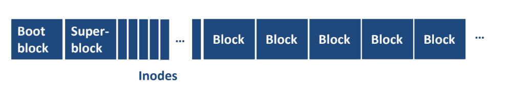
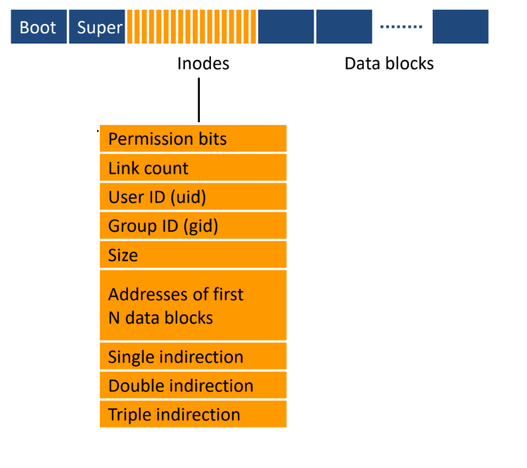
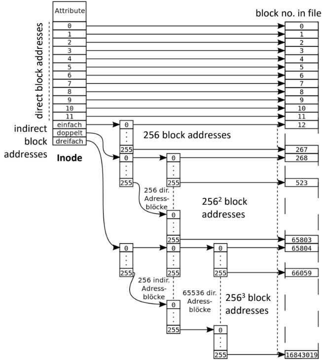
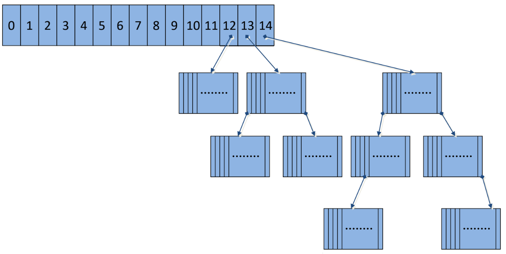

# UNIX-Dateisystem (ext-Familie als Beispiel)

## Aufbau

- **Boot Block**: Startprogramm.  
- **Superblock**: Metadaten des Dateisystems.  
- **Inodes**: enthalten Dateiinformationen.  
- **Datenblöcke**: eigentliche Inhalte.  

## Superblock
Der Superblock enthält die folgenden Informationen:

* Größe des Dateisystems in Blöcken
* Gesamtzahl der Inodes
* Anzahl der reservierten Blöcke
* Anzahl der freien Blöcke und Inodes
* Blockgröße
* Zeitstempel (letzter Mount, letzter Schreibzugriff, letzte Dateisystemprüfung)
* Nur für Root-Benutzer zugänglich

## Inodes

Für jedes Inode gilt:

- Feste Größe (z. B. 64 Byte).  
- Enthalten: Rechte, Link-Count, Owner, Größe, Blockadressen.  
- Besondere Inodes:
  - 0 = nicht existent  
  - 1 = defekte Blöcke  
  - 2 = Root-Verzeichnis  

## Indirektionen
- **Direkte Adressen** (z. B. 12 Blöcke).  
- Falls Datei größer: Nutzung von **einfacher, doppelter, dreifacher Indirektion**.  

 

Daraus ergibt sich eine Maximale grße von Dateien: Beispiel (1 KiB Block, 32-bit Blocknummern): 

$$
12 + 256 + 256^2 + 256^3 \text{ blocks} = 16843020 \text{ blocks} ≈ 16 \text{ GiB}
$$

