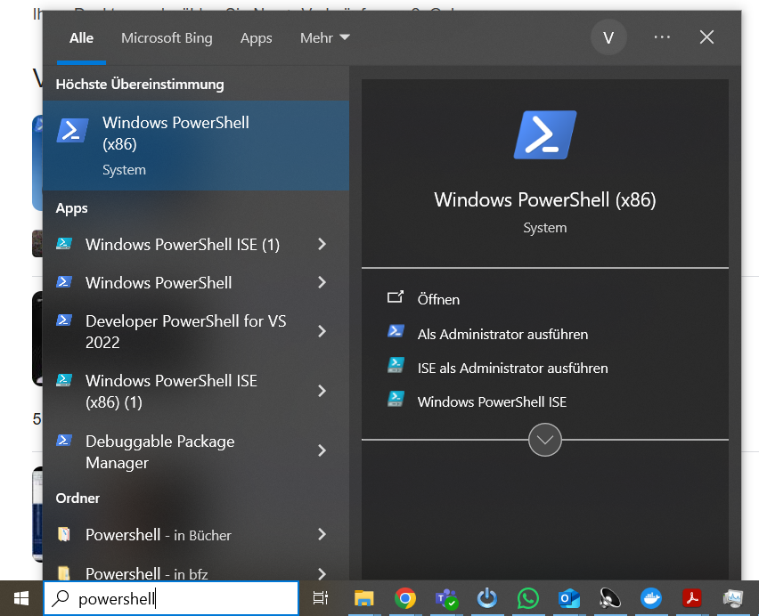
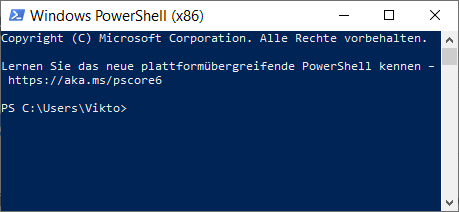
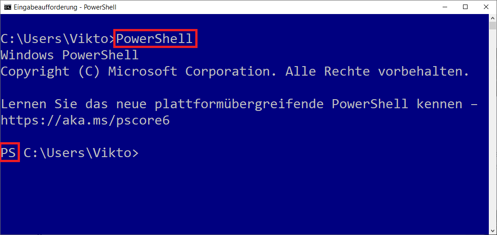
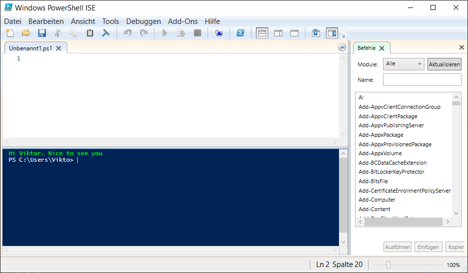

# Einstieg in Powershell

**PowerShell** ist ein plattformübergreifendes Tool von Microsoft für IT-Profis zur Automatisierung von Aufgaben und zur Systemverwaltung. 

Es ist eine Kombination aus einer Befehlszeilenshell und einer Skriptsprache, die auf .NET basiert und mit Objekten statt nur mit Text arbeitet, was das Verbinden von Befehlen erleichtert. 

Die Open-Source-Version PowerShell (auch PowerShell Core genannt) läuft unter Windows, Linux und macOS.

## PowerShell starten

Es gibt verschiedene Möglichkeiten PowerShell zu starten:

=== "Windows Poershell starten"
    Geben Sie in ihrer Suchleiste "powershell" ein und starten Sie die Windows PowerShell:

    

    

=== "Powershell in der beliebiger Console starten"
    Sie können auch in einer beliebigen Konsole PowerShell mit dem Befehl

    ```bash
    PowerShell
    ```

    starten. Dass Sie sich nun in der Powershell befinden, erkennen Sie
    an dem `PS` am Anfang der Zeile.

    

=== "Powershell ISE"
    Die PowerShell ISE (Integrated Scripting Environment) ist eine grafische Benutzeroberfläche (GUI) für Windows PowerShell, mit der Benutzer Skripte erstellen, testen und debuggen können

    

!!! tip "Trainings von Windows"
    [:fontawesome-solid-external-link: Einführung in Powershell](https://learn.microsoft.com/de-de/training/modules/introduction-to-powershell/){ target=_blank rel="noopener noreferrer" }
    
    [:fontawesome-solid-external-link: Ermitteln von Befehlen in PowerShell](https://learn.microsoft.com/de-de/training/modules/discover-commands/){ target=_blank rel="noopener noreferrer" }

    [:fontawesome-solid-external-link: Verknüpfen von Befehlen in einer Pipeline](https://learn.microsoft.com/de-de/training/modules/connect-commands/){ target=_blank rel="noopener noreferrer" }

    [:fontawesome-solid-external-link: Schreiben Ihres ersten PowerShell-Codes](https://learn.microsoft.com/de-de/training/modules/powershell-write-first/){ target=_blank rel="noopener noreferrer" }
