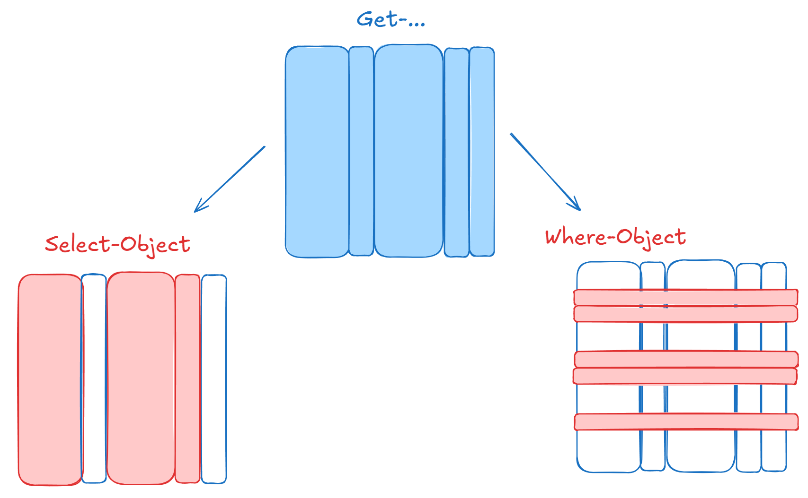

# Cmdlet


Ein PowerShell-Befehl, die in der Konsole ausgeführt werden kann, wird `Cmdlet` genannt.

Es hat immer die Form:

```bash
<Cmdlet> -Parameter Wert
```

```powershell
get-childitem                        # Listet Dateien/Ordner im aktuellen Verzeichnis
get-childitem -recurse -depth 2      # mit dem Zusatz -recurse durchsucht man auch alle Unterverzeichnisse -depth gibt tiefe an

get-help <Befehl>                    # Zeigt Hilfe zu einem Cmdlet
get-help <Befehl> -online            # Öffnet getOnline-Hilfe

get-command -Noun Date               # -noun sucht nach Cmdlets mit bestimmten Begriffen (im Beispiel Date)
get-command -noun Date -verb get     # -verb sucht nach Cmdlets mit bestimmten Verben (Beispiel get -> get-date)
get-command -noun D*                 # * dient als Platzhalter (Beispiel listet alle Cmdlets mit D... auf)
v
get-process                          # zeigt alle aktuell laufenden (Hintergrund)Prozesse an
stop-process -name <Name>            # beendet den angegebenen Prozess 
stop-process -name <Name> -confirm   # -confirm öffnet vor beenden ein Bestätigungsfenster

<Objekt> | get-member                # zeigt alle Methoden und Eigenschaften zu einem Objekt

show-command -name <Befehl>          # öffnet ein Fenster in dem man die Paramenter zu einem Befehl festlegen und diesen ausführen kann 

get-history                          # zeigt alle in der aktuellen PowerShell-Session eingegebenen Kommandozeilen
```

## Informationen verarbeiten und ausgeben

```powershell
Get-Process -Name powershell | Select-Object -Property Id, ProcessName
get-process -name powershell | select-object -property * | Export-csv eigenschaften.csv #Alle Eigenschaften in eine Datei ausgeben
Get-ChildItem -File | Select-Object -Property Extension, Length, Name  | sort-object -property name
# Ausgabe bestimmter Eigenschaften danach sortiert
1..3 | ForEach-Object -Process { Test-Connection 127.0.0.$_ -Count 1} # Arbeiten mit Prozessen
``` 


